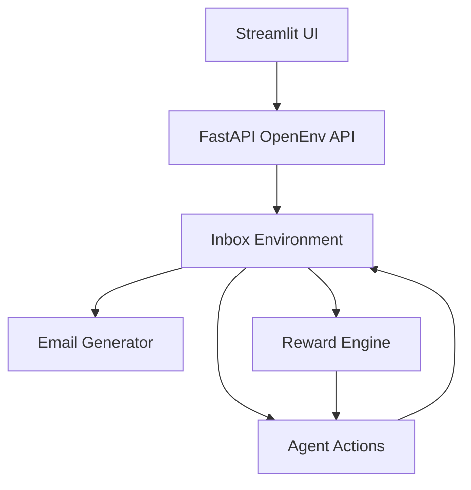
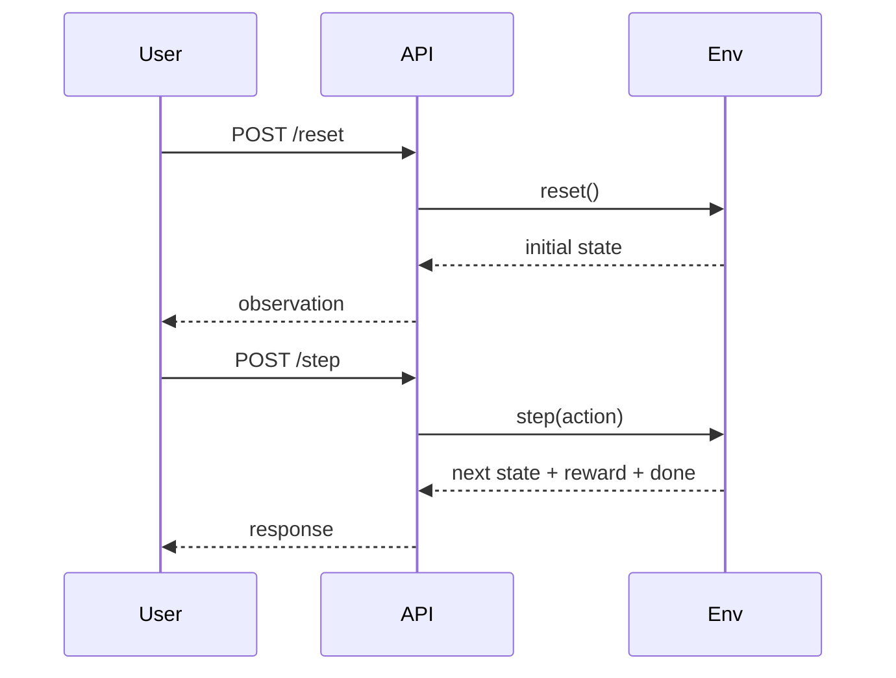

# 🚀 Email Declutter OpenEnv

### Agentic Email Triage Environment with OpenEnv API + Interactive Demo

---

## 🔷 Overview

Email Declutter OpenEnv is an agent-driven inbox triage environment built for the OpenEnv Hackathon. It models email handling as a sequential decision-making problem, where an AI agent processes emails and takes actions such as archive, flag, reply, and delete.

The system exposes a fully OpenEnv-compliant API for automated evaluation and also includes a Streamlit-based UI for interactive demonstration.

---

## 🎯 Problem Statement

Modern inboxes are overloaded with spam, promotions, and low-priority updates. Traditional systems rely on static filters and fail to adapt to ambiguity, prioritize dynamically, and handle evolving patterns.

We reframe inbox management as a decision-making environment where agents must act optimally over time under uncertainty.

---

## 🧠 Solution Approach

This project follows an environment-first design:

- Emails represent states
- Actions represent decisions
- Rewards represent feedback
- Episodes represent workflows

Agents interact with the environment and are evaluated based on cumulative performance.

---

## 🏗️ System Architecture



---

## 🧩 Core Components

### Inbox Environment

- Simulates email stream
- Maintains state and progression
- Tracks unread count
- Applies reward logic

### Email Generator

Generates synthetic emails across categories:

- important
- spam
- promotion
- social

### Action Space

`archive | flag | reply | delete`

### Reward Function

- Correct action → positive reward
- Incorrect action → penalty
- Missing important email → high penalty
- Handling spam correctly → bonus

---

## ⚙️ OpenEnv API

### POST /reset

Starts a fresh episode and returns the initial observation.

### POST /step

Accepts an action input and returns the next state, reward, and done flag.

### GET /state

Returns the current environment state.

---

## 📦 Example API Flow



---

## 🖥️ Interactive Demo

The project includes a Streamlit UI for:

- visualizing inbox state
- simulating actions
- observing rewards

### Run locally

```bash
pip install -r requirements.txt
streamlit run demo/app.py
```

---

## 🐳 Docker Deployment

```bash
docker build -t email-declutter .
docker run -p 7860:7860 email-declutter
```

---

## 📁 Project Structure

```text
.
├── main.py
├── openenv.yaml
├── inference.py
├── Dockerfile
├── requirements.txt
├── env/
│   ├── __init__.py
│   └── inbox_env.py
└── demo/
    └── app.py
```

---

## 📊 Evaluation

The environment evaluates agents using:

- total reward
- decision accuracy
- task completion behavior
- penalty handling

---

## 🧠 Hackathon Alignment

This project satisfies the core OpenEnv requirements:

- reset(), step(), and state() implemented
- OpenEnv API compliant
- Dockerized deployment
- inference script included
- multi-action environment design
- public deployment for evaluator access

---

## 🌍 Business Relevance

This framework is relevant to:

- email clients
- enterprise workflows
- notification management systems
- AI copilots and assistants

It demonstrates the transition from static filtering to intelligent decision-making systems.

---

## ⚠️ Limitations

- synthetic dataset
- simplified reward logic
- no user personalization
- no long-term memory

---

## 🚀 Future Work

- reinforcement learning agents
- memory-aware systems
- real-world data integration
- confidence-based escalation
- human-in-the-loop workflows

---

## 🏁 Conclusion

Email Declutter OpenEnv demonstrates the shift from static classification systems to intelligent decision-making environments. It reflects the next generation of agentic AI systems, where success is measured not only by prediction accuracy but by the quality of actions taken over time.
