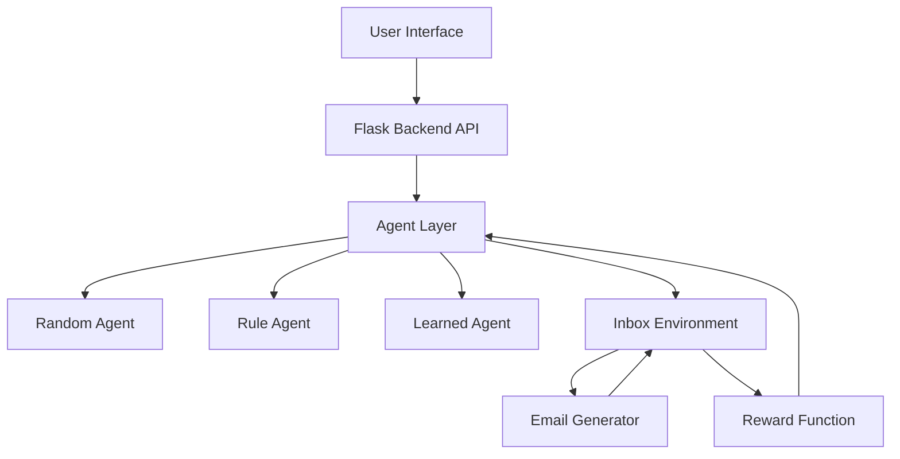

# 🚀 AI Inbox Intelligence

### Agentic Email Triage under Uncertainty

---

## 🔷 Executive Summary

Modern inboxes are overloaded with noise — spam, promotions, and low-priority updates — making it difficult to identify what truly matters.

**AI Inbox Intelligence** is a lightweight, agent-driven simulation system that models inbox management as a **sequential decision-making problem**. Instead of static filtering, the system evaluates how different AI agents perform in triaging emails under uncertainty using a reward-driven environment.

This project demonstrates how **agentic AI systems** can move beyond classification into **decision-making frameworks** that balance accuracy, risk, and priorities.

---

## 🎯 Problem Statement

Traditional email filtering systems rely on:

* static rules
* limited contextual understanding
* rigid classification pipelines

These systems struggle with:

* ambiguous emails
* evolving spam patterns
* prioritization under uncertainty

We reframe inbox management as:

> **A dynamic environment where agents must make optimal decisions over time with incomplete information.**

---

## 🧠 Solution Overview

This project introduces a **simulation-first approach** where:

* Emails are treated as **states**
* Agents select **actions (labels)**
* A reward system evaluates decisions
* Performance is measured over multiple steps

The system supports multiple agent strategies, enabling comparison between:

* baseline (random)
* heuristic (rule-based)
* semantic (LLM-powered)

---

## 🏗️ System Architecture



---

## 🧩 Core Components

### 1. Agent Layer

Implements multiple decision-making strategies:

* **Random Agent**
  Baseline agent for benchmarking performance

* **Rule-Based Agent**
  Keyword-driven heuristics simulating traditional filters

* **Learned Agent (Zero-shot NLP)**
  Semantic reasoning using transformer-based models

---

### 2. Inbox Environment

Simulates a continuous email stream:

* generates emails dynamically
* tracks agent decisions
* applies reward logic
* maintains episode lifecycle

---

### 3. Email Generator

Creates diverse synthetic emails across categories:

* important
* spam
* promotion
* social
* later

Introduces variability and ambiguity to simulate real-world inbox noise.

---

### 4. Reward Function

Encodes decision quality:

* ✅ Correct classification → positive reward
* ❌ Incorrect classification → penalty
* 🚨 Missing important emails → higher penalty
* 🛑 Detecting spam → bonus

This enforces **risk-aware decision-making**.

---

## ⚙️ State & Action Design

### State Representation

Each email consists of:

* subject
* sender
* email_text
* hidden true_label

---

### Action Space

```text
important | spam | promotion | social | later
```

---

## 📊 Evaluation Framework

Agents are evaluated across multiple dimensions:

* Accuracy
* Total Reward
* Label-wise Accuracy
* Processed Emails
* Correct Predictions

This enables **comparative benchmarking** between agent strategies.

---

## 🖥️ Demo Capabilities

* Interactive inbox simulation
* Real-time agent predictions
* Dynamic switching between agents
* Live performance metrics:

  * accuracy
  * reward accumulation
  * spam detection
  * important email handling

---

## ▶️ Local Setup

```bash
pip install -r requirements.txt
python demo/app.py
```

Access the application at:

```text
http://127.0.0.1:5000
```

---

## 🐳 Docker Deployment

Build and run using Docker:

```bash
docker build -t email-declutter .
docker run -p 5000:5000 email-declutter
```

Or using Docker Compose:

```bash
docker compose up --build
```

---

## 🌍 Business Relevance

This framework mirrors real-world applications in:

* email clients (Gmail, Outlook)
* notification management systems
* enterprise workflow prioritization
* AI copilots and assistants

It highlights the transition from:

> **rule-based automation → intelligent decision systems**

---

## ⚠️ Limitations

* synthetic dataset (not real emails)
* simplified reward function
* no long-term memory or user personalization
* dependency on external models for learned agent

---

## 🚀 Future Roadmap

* reinforcement learning (policy optimization)
* memory-aware agents (context persistence)
* multi-action workflows (archive, reply, defer)
* real-world dataset integration
* human-in-the-loop decision systems
* confidence-based escalation

---

## 🧠 Hackathon Alignment

This project directly aligns with:

* ✅ Agentic AI design
* ✅ Environment-based learning
* ✅ Decision-making under uncertainty
* ✅ Multi-agent comparison
* ✅ Reward-driven evaluation

---

## 🏁 Closing Note

AI Inbox Intelligence is not just a classifier.

It is a **decision simulation framework** that demonstrates how AI agents can:

* prioritize effectively
* handle ambiguity
* optimize outcomes over time

This reflects the next evolution of AI systems —
from prediction → to intelligent action.

---

## 🔗 Technology Stack

* Python
* Flask
* Transformers (HuggingFace)
* HTML / CSS / JavaScript
* Custom Simulation Engine
